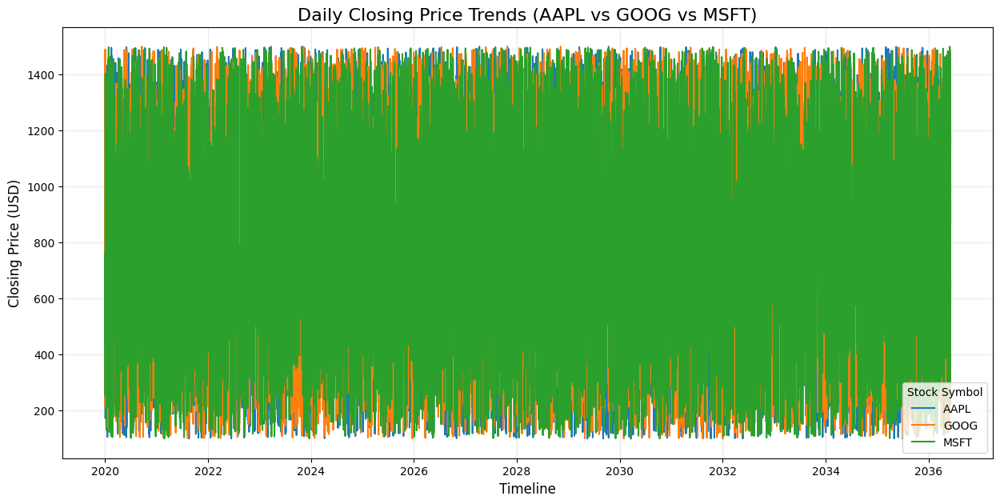

# 📈 Stock Market Analytics: An End-to-End ETL Journey

I built this project because I wanted to see if I could take messy, real-world financial data and turn it into a system that actually tells a story. It’s one thing to look at a stock price on a website, but it’s another to build a full pipeline that cleans, stores, and analyzes that data from scratch.

This project is a complete end-to-end workflow using **Python, MySQL, and Git** to handle everything from the first "dirty" CSV to the final visual report.

---

### 🚩 The Problem Statements
In financial data engineering, the "raw" state of data often presents significant hurdles that prevent accurate decision-making. I designed this project to solve these specific real-world challenges:

1. **Inconsistent Data Quality:** Raw CSV exports frequently contain duplicate rows, missing volume metrics, and "impossible" price points.
2. **Disconnected Information:** Data for multiple companies (AAPL, GOOG, MSFT) starts in separate files, making cross-company performance comparison slow.
3. **Lack of Trend Clarity:** Daily price fluctuations are "noisy." Without calculating moving averages, it is difficult to see the underlying market direction.
4. **Manual Scalability Issues:** Cleaning data manually is not sustainable. There is a need for a repeatable ETL pipeline that ensures **Data Integrity**.

---

### 🧠 The ETL Solution
Using **Pandas and NumPy**, I built a cleaning pipeline to address the problems above:
* **Fixed the gaps:** Used median imputation for prices and zero-filling for volume.
* **Enforced Logic:** Created validation rules to ensure every "High" and "Low" price made sense.
* **Added Context:** Calculated daily returns and tagged movements as **UP, DOWN, or NO_CHANGE**.

---

### 📊 Dashboards & Visual Reports
Instead of just looking at spreadsheets, I focused on creating visual reports that highlight the "big picture."

#### **1. Price Trend & Moving Averages**
By plotting 7-day and 30-day moving averages (MA), I filtered out daily market "noise" to reveal the actual long-term direction.

#### **2. Market Sentiment Distribution**
I analyzed the frequency of daily price movements to see how often these tech giants actually trend "UP" versus "DOWN."

#### **3. Multi-Stock Comparison**
A high-level view of daily closing prices across AAPL, GOOG, and MSFT to track relative performance.

#### **4. Volume-Price Correlation**
I used a heatmap to analyze how trading volume correlates with price movement.

---

### 🎯 Business Goals Achieved
* **Performance Tracking:** Identified which stock had the best average daily returns.
* **Risk Evaluation:** Measured volatility levels to evaluate investor risk.
* **Trend Smoothing:** Calculated moving averages for long-term trend analysis.
* **Anomaly Detection:** Spotted abnormal spikes in trading volume.
* **Data Integrity:** Implemented strict validation rules so the database never accepts "bad" data.

---

### 🛠️ The Tech Stack
* **Python:** (Pandas, NumPy, Matplotlib)
* **MySQL:** (Complex joins, Aggregations, Window Functions)
* **Git:** (Version control)

---

### 🚀 How to Explore
1. Clone the repo.
2. Install dependencies: `pip install -r requirements.txt`.
3. Check out the **notebooks/** folder to see the logic.
4. View the final polished charts in the **reports/** folder.
